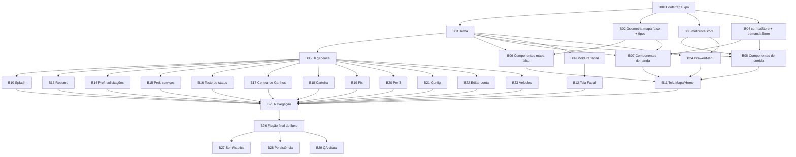

# Plano de implementação — 99 Motorista v6

Este documento organiza a implementação em React Native/Expo do protótipo
`RotaFacil Motorista v6.dc.html` (Claude Design, projeto
`ef0675a9-0509-4237-afa7-e417c1c11785`) em **blocos** agrupados em **ondas**,
otimizado para execução paralela por sub-agentes. Nenhum código foi escrito
ainda — este é só o mapa do trabalho.

**Nome do app na implementação: "99", não "RotaFácil"/"RF".** O nome
"RotaFácil" era só o rótulo fictício usado no protótipo original; a partir de
agora, qualquer string visível do app que hoje diga "RotaFácil" ou "RF" deve
virar "99" na implementação (ex.: monograma da splash, wordmark, banner
promocional, "Conta RF" → "Conta 99"). Isso **não** renomeia o arquivo de
referência `.design-import/RotaFacil Motorista v6.dc.html` — esse nome é o do
arquivo original baixado do Claude Design e continua sendo citado como está,
só como ponteiro de arquivo. Ver §5 abaixo para o detalhe por bloco.

## 0. Fonte de verdade

O protótipo foi baixado e decodificado localmente (não editar, é referência):

- `.design-import/RotaFacil Motorista v6.dc.html` — 1823 linhas, markup do protótipo inteiro
- `.design-import/logic.js` — 657 linhas, a classe `Component` (estado, dados estáticos, `renderVals()`) que controla tudo
- `.design-import/support.js` — runtime do Claude Design (dc-runtime); **não porta para RN**, é só o motor que interpreta `{{ }}`, `sc-if`, `sc-for` no navegador

Documentos já existentes no projeto e usados como referência de convenção:

- [ARQUITETURA.md](ARQUITETURA.md) — stack, estrutura de pastas (`app/`, `src/state/`, `src/servicos/`, `src/tema/`, `src/components/`), modelo de dados, roadmap de módulos
- [DESIGN_SYSTEM.md](DESIGN_SYSTEM.md) — tokens de cor/tipografia/espaçamento (§2), especificação de componentes (§3), especificação por tela (§4), e a seção §13 que é exatamente a v6 (trajeto aderente às ruas)

**Achado importante:** o mapa deste protótipo é uma **grade falsa desenhada com `
`s absolutos** (ruas, quadras, rótulos, hexágonos de demanda, rota SVG) — não usa `react-native-maps`, GPS real nem chave de API. Isso simplifica muito a portabilidade: dá para reproduzir fielmente com `View`/`StyleSheet`/`react-native-svg`, sem depender de Google Maps SDK. A tradução para mapa real (`react-native-maps` + Directions API) é um passo *posterior*, fora deste plano (ver DESIGN_SYSTEM §13.2-C, opcional/futuro).

## 1. Convenção de cada bloco

Cada bloco tem um arquivo em `contextos/<ID>-<nome>.md` com:

- **Objetivo** — o que esse bloco entrega
- **Depende de** — blocos que precisam estar prontos antes
- **Bloqueia** — blocos que esperam por este
- **Arquivos a criar** — caminhos exatos conforme `ARQUITETURA.md §4`
- **Fonte no protótipo** — linhas exatas em `.design-import/*` para consulta
- **Especificação** — o que extrair/traduzir (cores, comportamento, estados)
- **Notas de tradução Web → RN** — armadilhas específicas de DOM/CSS → View/Reanimated
- **Critério de aceite** — como saber que terminou

Um sub-agente deve conseguir pegar **um único arquivo de contexto** e implementar o bloco sem reler esta conversa nem o protótipo inteiro.

## 2. Ondas e paralelismo

| Onda | Blocos | Paralelismo máx. | Depende de |
|---|---|---|---|
| **0** | B00 | 1 (sequencial, bloqueia tudo) | — |
| **1** | B01, B02, B03, B04 | 4 agentes | B00 |
| **2** | B05, B06, B07, B08, B09, B24 | 6 agentes | Onda 1 (cada um só o que precisa — ver grafo) |
| **3** | B10, B11, B12, B13, B14, B15, B16, B17, B18, B19, B20, B21, B22, B23 | até 14 agentes | Onda 2 |
| **4** | B25 → B26 | sequencial (2 etapas) | Onda 3 completa |
| **5** | B27, B28, B29 | 3 agentes | B26 |

**Observação prática:** a Onda 3 tem 14 blocos elegíveis para paralelo, mas
**B11 (Mapa/Home) é o mais complexo e demorado** — é a tela que compõe quase
todos os componentes das ondas anteriores (mapa falso, zonas de demanda, drawer,
card de oferta, painel de corrida, header, banner, FABs). Não trate B11 como
"mais um bloco igual aos outros" na hora de alocar agentes — dê a ele mais
tempo/tokens, ou considere quebrá-lo em dois sub-blocos se o agente escalado
para ele não conseguir terminar numa sessão:
  - B11a — mapa base (ruas, quadras, hexágonos, marcador, pan/zoom)
  - B11b — UI fixa sobreposta (header, barra inferior, FABs, banner) + wiring com B08/B24

As telas B14–B23 (preferências, teste de status, central de ganhos, carteira,
pix, perfil, config, conta, veículos) são teles "empurradas" (`push`) que só
dependem de B05 (UI genérica) + B03 (store) — são as mais fáceis de paralelizar
de verdade porque não têm dependência cruzada entre si.

## 3. Índice de blocos

| ID | Nome | Onda | Arquivo de contexto |
|---|---|---|---|
| B00 | Bootstrap do projeto Expo | 0 | [contextos/B00-bootstrap.md](contextos/B00-bootstrap.md) |
| B01 | Tema (cores/tipografia/espaçamento) | 1 | [contextos/B01-tema.md](contextos/B01-tema.md) |
| B02 | Geometria do mapa falso + tipos | 1 | [contextos/B02-geometria-mapa.md](contextos/B02-geometria-mapa.md) |
| B03 | motoristaStore | 1 | [contextos/B03-motorista-store.md](contextos/B03-motorista-store.md) |
| B04 | corridaStore + demandaStore | 1 | [contextos/B04-corrida-demanda-store.md](contextos/B04-corrida-demanda-store.md) |
| B05 | Componentes de UI genérica | 2 | [contextos/B05-ui-generica.md](contextos/B05-ui-generica.md) |
| B06 | Componentes do mapa falso | 2 | [contextos/B06-componentes-mapa.md](contextos/B06-componentes-mapa.md) |
| B07 | Componentes de demanda (hexágonos) | 2 | [contextos/B07-componentes-demanda.md](contextos/B07-componentes-demanda.md) |
| B08 | Componentes de corrida (oferta/sheet) | 2 | [contextos/B08-componentes-corrida.md](contextos/B08-componentes-corrida.md) |
| B09 | Moldura facial oval | 2 | [contextos/B09-moldura-facial.md](contextos/B09-moldura-facial.md) |
| B24 | Drawer / menu lateral | 2 | [contextos/B24-drawer-menu.md](contextos/B24-drawer-menu.md) |
| B10 | Tela Splash | 3 | [contextos/B10-tela-splash.md](contextos/B10-tela-splash.md) |
| B11 | Tela Mapa/Home | 3 | [contextos/B11-tela-mapa-home.md](contextos/B11-tela-mapa-home.md) |
| B12 | Tela Verificação facial | 3 | [contextos/B12-tela-facial.md](contextos/B12-tela-facial.md) |
| B13 | Tela Resumo da corrida | 3 | [contextos/B13-tela-resumo.md](contextos/B13-tela-resumo.md) |
| B14 | Tela Preferências de solicitações | 3 | [contextos/B14-tela-pref-solicitacoes.md](contextos/B14-tela-pref-solicitacoes.md) |
| B15 | Tela Preferências de serviços | 3 | [contextos/B15-tela-pref-servicos.md](contextos/B15-tela-pref-servicos.md) |
| B16 | Tela Teste de status | 3 | [contextos/B16-tela-teste-status.md](contextos/B16-tela-teste-status.md) |
| B17 | Tela Central de Ganhos | 3 | [contextos/B17-tela-central-ganhos.md](contextos/B17-tela-central-ganhos.md) |
| B18 | Tela Carteira (Conta 99) | 3 | [contextos/B18-tela-carteira.md](contextos/B18-tela-carteira.md) |
| B19 | Tela Transferência Pix | 3 | [contextos/B19-tela-pix.md](contextos/B19-tela-pix.md) |
| B20 | Tela Perfil | 3 | [contextos/B20-tela-perfil.md](contextos/B20-tela-perfil.md) |
| B21 | Tela Configurações de perfil | 3 | [contextos/B21-tela-config.md](contextos/B21-tela-config.md) |
| B22 | Tela Editar conta | 3 | [contextos/B22-tela-conta.md](contextos/B22-tela-conta.md) |
| B23 | Tela Veículos + modal | 3 | [contextos/B23-tela-veiculos.md](contextos/B23-tela-veiculos.md) |
| B25 | Navegação (Expo Router + push/voltar) | 4 | [contextos/B25-navegacao.md](contextos/B25-navegacao.md) |
| B26 | Fiação final do fluxo de estado | 4 | [contextos/B26-fiacao-fluxo.md](contextos/B26-fiacao-fluxo.md) |
| B27 | Som e vibração | 5 | [contextos/B27-som-haptics.md](contextos/B27-som-haptics.md) |
| B28 | Persistência (AsyncStorage) | 5 | [contextos/B28-persistencia.md](contextos/B28-persistencia.md) |
| B29 | QA visual vs. checklists | 5 | [contextos/B29-qa-visual.md](contextos/B29-qa-visual.md) |

## 4. Como acionar isto no futuro

Para cada onda: abrir um sub-agente por bloco elegível, passando **apenas**
o conteúdo do arquivo de contexto correspondente (mais os arquivos que ele
lista em "depende de", já implementados). Não é necessário reenviar este
plano inteiro nem o protótipo — cada contexto já tem os ponteiros de linha
exatos para `.design-import/`.

Ordem recomendada de execução: Onda 0 → Onda 1 (paralelo) → Onda 2 (paralelo)
→ Onda 3 (paralelo, priorizando B11 com mais tempo) → Onda 4 (sequencial:
B25 depois B26) → Onda 5 (paralelo).

## 5. Convenção de nome — "RotaFácil"/"RF" viram "99"

O protótipo original usa a marca fictícia "RotaFácil" (e a abreviação "RF")
em algumas strings visíveis. Na implementação, todas viram **"99"** — é
consistente com o próprio nome do projeto (`ARQUITETURA.md`: *"Projeto '99
Motorista' (clone didático)"*) e com o precedente já registrado em
`DESIGN_SYSTEM.md §14` (léxico v7, que já removia a palavra "rota" da
interface). Isso é só troca de texto — nenhum layout, cor, fonte ou animação muda.

**Strings que precisam trocar** (linhas do `.design-import/RotaFacil Motorista v6.dc.html`,
já anotadas nos contextos de bloco correspondentes):

| Onde | Linha | Original | Vira | Bloco |
|---|---|---|---|---|
| Splash — monograma | 1089 | `RF` | `99` | [B10](contextos/B10-tela-splash.md) |
| Splash — wordmark | 1090 | `RotaFácil Motorista` | `99 Motorista` | [B10](contextos/B10-tela-splash.md) |
| Mapa/Home — banner promocional | 180 | `...ganhe R$ 500 na RotaFácil` | `...ganhe R$ 500 na 99` (ver texto autêntico em `DESIGN_SYSTEM.md §2.9`) | [B11](contextos/B11-tela-mapa-home.md) |
| Central de Ganhos — card de fase | 678 | `Rota RF` | `99` (ou "Fase 99", ajustar ao contexto do card "Disponível na sua fase") | [B17](contextos/B17-tela-central-ganhos.md) |
| Central de Ganhos — item de menu | 702 | `Conta RF` | `Conta 99` | [B17](contextos/B17-tela-central-ganhos.md) |
| Carteira — título | 756 | `Conta RF` | `Conta 99` | [B18](contextos/B18-tela-carteira.md) |
| Carteira — card de destaque | 815 | `RF Pay Informe` | `99 Pay` | [B18](contextos/B18-tela-carteira.md) |

**Não precisa trocar:** a linha "RotaFácil · Motorista" (linha 47) e o array
`nav` do `logic.js` (linha 439, labels tipo `'Conta RF ⤢'`) — são texto do
**painel de navegação do próprio Claude Design** (a barra lateral de debug
fora do frame do celular, usada só para pular entre estados do protótipo),
não aparecem dentro do app de verdade e não são portados (ver `contextos/B29-qa-visual.md`
e `contextos/B25-navegacao.md` — esse painel de debug não faz parte do escopo de produção).
